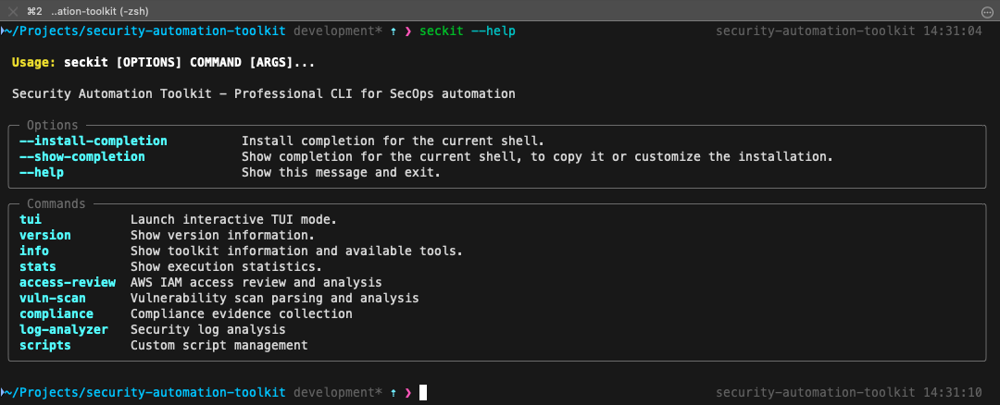
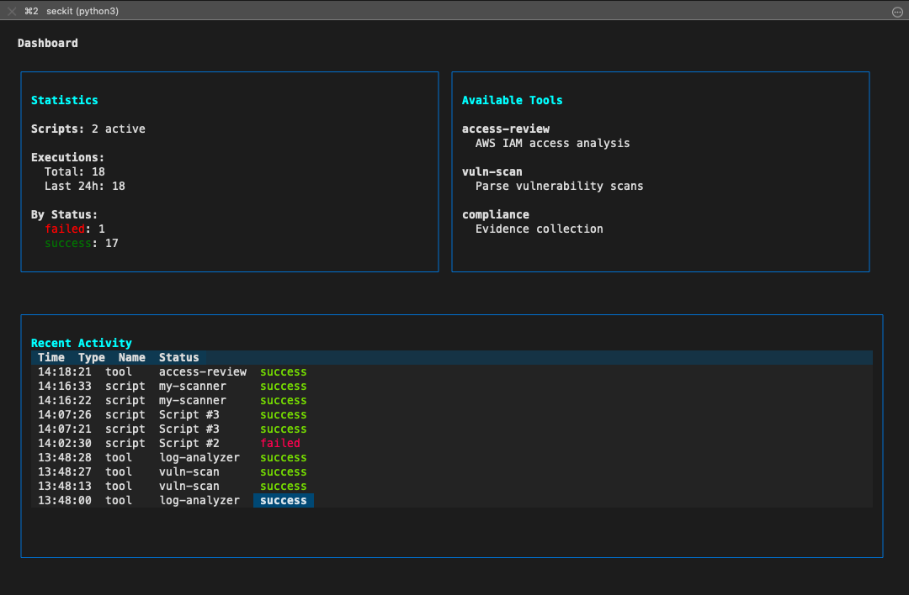
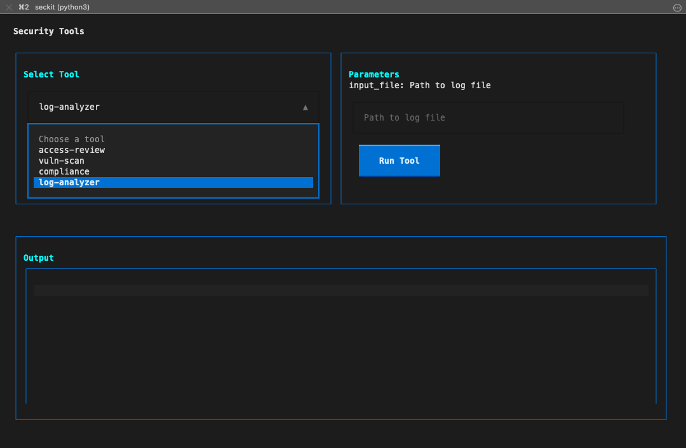
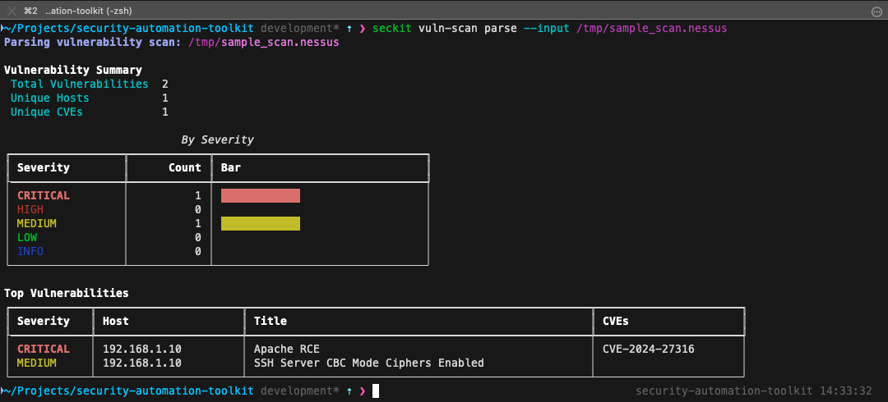
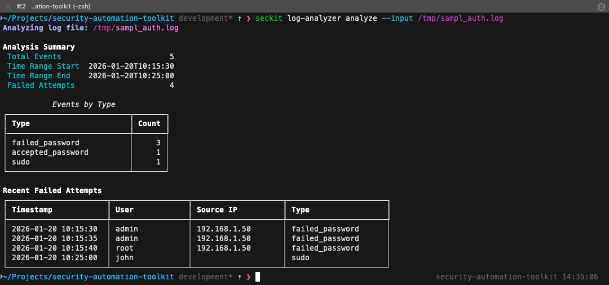
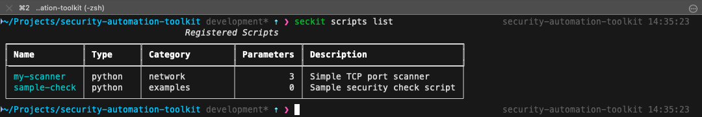
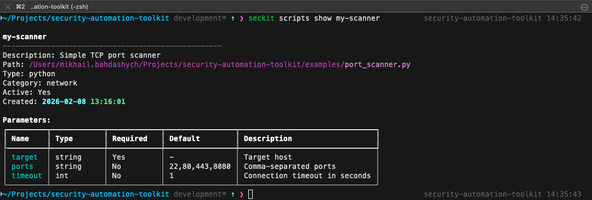
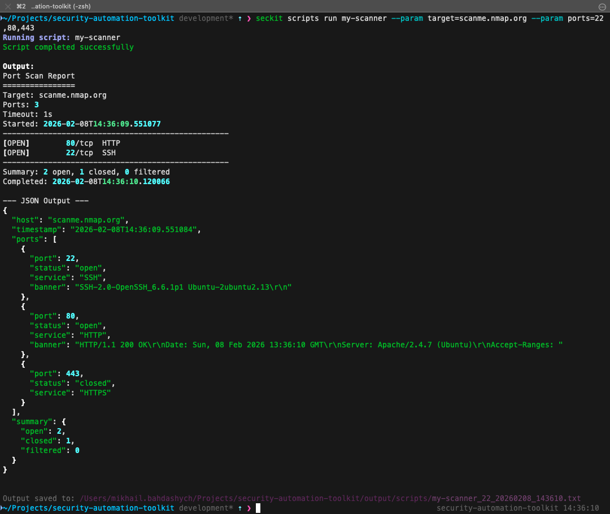
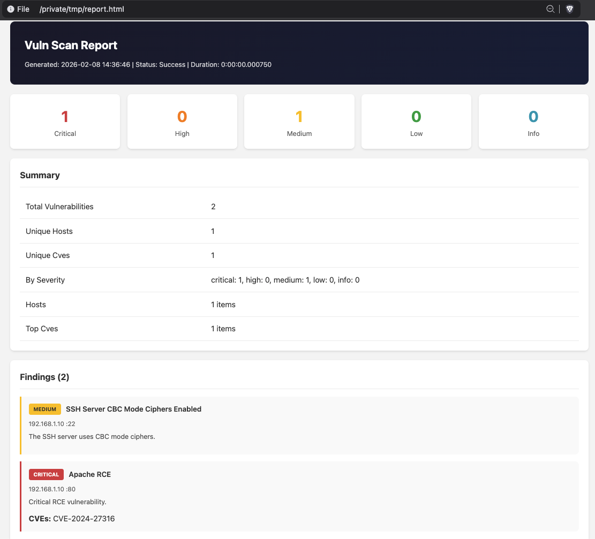

# Security Automation Toolkit (seckit)

A professional command-line tool for SecOps automation, providing IAM analysis, vulnerability management, compliance evidence collection, and security log analysis. Features both CLI and interactive TUI modes.



## Table of Contents

- [Overview](#overview)
- [Features](#features)
- [Installation](#installation)
- [Configuration](#configuration)
- [Usage](#usage)
  - [CLI Commands](#cli-commands)
  - [Interactive TUI](#interactive-tui)
- [Tools](#tools)
  - [Access Review](#access-review)
  - [Vulnerability Scanner](#vulnerability-scanner)
  - [Compliance Evidence Collector](#compliance-evidence-collector)
  - [Log Analyzer](#log-analyzer)
- [Custom Scripts](#custom-scripts)
- [Output Formats](#output-formats)
- [Examples](#examples)
  - [Network Security Scan](#network-security-scan)
  - [Log Analysis](#log-analysis)
  - [Compliance Audit](#compliance-audit)
- [License](#license)

## Overview

The Security Automation Toolkit (`seckit`) is designed for security professionals who need to automate common SecOps tasks. It consolidates multiple security workflows into a single, unified tool with:

- **AWS IAM Analysis** - Review users, roles, permissions, and detect security issues
- **Vulnerability Management** - Parse and normalize scan outputs from Nessus, Qualys, and OpenVAS
- **Compliance Automation** - Collect evidence for SOC 2, ISO 27001, and PCI-DSS frameworks
- **Log Analysis** - Analyze auth.log, syslog, and CloudTrail for security events and anomalies
- **Custom Scripts** - Register and execute your own security scripts with parameter validation

## Features

| Feature | Description |
|---------|-------------|
| Multi-format Output | JSON, CSV, HTML, and Markdown reports |
| Interactive TUI | Full-featured terminal UI with keyboard navigation |
| Script Management | Register, execute, and track custom security scripts |
| Execution History | SQLite-backed tracking of all tool and script runs |
| AWS Integration | Native support for IAM, CloudTrail, Config, and Security Hub |
| Anomaly Detection | Automatic detection of brute force attempts, unusual activity |

## Installation

### Prerequisites

- Python 3.12 or higher
- [UV](https://docs.astral.sh/uv/) package manager (recommended) or pip

### Install with UV

```bash
# Clone the repository
git clone https://github.com/yourusername/security-automation-toolkit.git
cd security-automation-toolkit

# Install dependencies
uv sync

# Verify installation
uv run seckit --help
```

## Configuration

The toolkit uses environment variables and a configuration file for settings.

### Environment Variables

| Variable | Description | Default |
|----------|-------------|---------|
| `SECKIT_DB_PATH` | Path to SQLite database | `~/.seckit/seckit.db` |
| `SECKIT_SCRIPTS_DIR` | Directory for custom scripts | `~/.seckit/scripts` |
| `SECKIT_OUTPUT_DIR` | Default output directory | `./output` |
| `SECKIT_AWS_PROFILE` | AWS profile name | Default profile |
| `SECKIT_AWS_REGION` | AWS region | `us-east-1` |
| `SECKIT_LOG_LEVEL` | Logging level | `INFO` |

### AWS Configuration

For AWS-related tools (Access Review, Compliance), configure your credentials:

```bash
# Using AWS CLI
aws configure

# Or set environment variables
export AWS_ACCESS_KEY_ID=your_access_key
export AWS_SECRET_ACCESS_KEY=your_secret_key
export AWS_DEFAULT_REGION=us-east-1
```

## Usage

### CLI Commands

```bash
# Show all available commands
seckit --help

# Show tool information and configuration
seckit info

# Show execution statistics
seckit stats

# Launch interactive TUI
seckit tui
```

### Command Groups

| Command | Description |
|---------|-------------|
| `seckit access-review` | AWS IAM access analysis |
| `seckit vuln-scan` | Vulnerability scan parsing |
| `seckit compliance` | Compliance evidence collection |
| `seckit log-analyzer` | Security log analysis |
| `seckit scripts` | Custom script management |

### Interactive TUI

Launch the interactive terminal interface:

```bash
seckit tui
```



**Keyboard shortcuts:**
- `d` - Dashboard
- `t` - Tools
- `s` - Scripts
- `r` - Results
- `q` - Quit
- `?` - Help



## Tools

### Access Review

Analyze AWS IAM for security issues including unused accounts, missing MFA, excessive permissions, and stale access keys.

```bash
# Run full access review
seckit access-review run

# Generate HTML report
seckit access-review run --format html --output iam-report.html

# Customize checks
seckit access-review run \
    --check-mfa \
    --check-access-keys \
    --inactive-days 60
```

**Detected Issues:**
- Users without MFA enabled
- Inactive users and roles
- Old/unused access keys
- Overly permissive admin policies
- Multiple active access keys

### Vulnerability Scanner

Parse and normalize vulnerability scan outputs from popular scanners.



```bash
# Parse Nessus scan
seckit vuln-scan parse --input scan.nessus

# Parse with minimum severity filter
seckit vuln-scan parse --input scan.nessus --min-severity high

# Export to CSV
seckit vuln-scan parse --input scan.nessus --format csv --output vulns.csv

# Show summary only
seckit vuln-scan summary --input scan.nessus
```

**Supported Scanners:**
- Nessus (.nessus XML)
- Qualys (XML format)
- OpenVAS (XML format)

### Compliance Evidence Collector

Collect evidence for compliance frameworks from AWS services.

```bash
# Collect SOC 2 evidence
seckit compliance collect --framework soc2 --output evidence/

# Collect specific controls
seckit compliance collect --framework iso27001 --controls A.5.15,A.8.9

# List available frameworks and controls
seckit compliance frameworks

# Check compliance status
seckit compliance status --framework pci-dss
```

**Supported Frameworks:**
- SOC 2 Type II
- ISO 27001:2022
- PCI-DSS v4.0

### Log Analyzer

Analyze security logs for events, patterns, and anomalies.



```bash
# Analyze auth.log
seckit log-analyzer analyze --input /var/log/auth.log

# Filter failed logins
seckit log-analyzer analyze --input auth.log --pattern failed-logins

# Analyze CloudTrail
seckit log-analyzer analyze --input cloudtrail.json --type cloudtrail

# Show top source IPs
seckit log-analyzer top-sources --input auth.log --limit 20

# Show top users
seckit log-analyzer top-users --input auth.log
```

**Supported Log Types:**
- auth.log / secure (Linux authentication)
- syslog / messages
- AWS CloudTrail (JSON)

**Anomaly Detection:**
- Brute force attempts (multiple failures from same IP)
- After-hours activity
- High privilege escalation (sudo) usage

## Custom Scripts

Register and execute custom Python or Shell scripts with parameter validation and execution tracking.



### Register a Script

```bash
# Register a Python script
seckit scripts register my-scanner \
    --path /path/to/scanner.py \
    --description "Custom network scanner" \
    --category network

# Register with parameters (JSON format)
seckit scripts register my-scanner \
    --path /path/to/scanner.py \
    --params '[
        {"name": "target", "type": "string", "required": true, "description": "Target IP/hostname"},
        {"name": "ports", "type": "string", "default": "22,80,443", "description": "Ports to scan"},
        {"name": "timeout", "type": "int", "default": 5, "description": "Timeout in seconds"}
    ]'
```

### Manage Scripts

```bash
# List all scripts
seckit scripts list

# Show script details
seckit scripts show my-scanner

# View execution history
seckit scripts history

# Delete a script
seckit scripts delete my-scanner
```



### Execute a Script

```bash
# Run with parameters
seckit scripts run my-scanner \
    --param target=192.168.1.1 \
    --param ports=22,80,443,8080

# Run with timeout
seckit scripts run my-scanner --param target=example.com --timeout 300
```



## Output Formats

All tools support multiple output formats:

| Format | Extension | Description |
|--------|-----------|-------------|
| JSON | `.json` | Machine-readable, full data |
| CSV | `.csv` | Spreadsheet-compatible, findings only |
| HTML | `.html` | Professional reports with styling |
| Markdown | `.md` | Documentation-friendly format |



```bash
# Specify output format
seckit vuln-scan parse --input scan.nessus --format html --output report.html
seckit log-analyzer analyze --input auth.log --format csv --output events.csv
```

## Examples

### Network Security Scan

Create a simple port scanner script and use it with seckit.

**Step 1: Create the scanner script**

```python
#!/usr/bin/env python3
# save as: my_scanner.py

import argparse
import socket
import json
from datetime import datetime

def scan_port(host, port, timeout=1):
    """Check if a port is open."""
    try:
        sock = socket.socket(socket.AF_INET, socket.SOCK_STREAM)
        sock.settimeout(timeout)
        result = sock.connect_ex((host, port))
        sock.close()
        return result == 0
    except:
        return False

def main():
    parser = argparse.ArgumentParser()
    parser.add_argument('--target', required=True, help='Target host')
    parser.add_argument('--ports', default='22,80,443', help='Ports to scan')
    parser.add_argument('--timeout', type=int, default=2, help='Timeout')
    args = parser.parse_args()

    ports = [int(p.strip()) for p in args.ports.split(',')]
    results = {'target': args.target, 'timestamp': datetime.now().isoformat(), 'open_ports': []}

    print(f"Scanning {args.target}...")
    for port in ports:
        if scan_port(args.target, port, args.timeout):
            print(f"  Port {port}: OPEN")
            results['open_ports'].append(port)
        else:
            print(f"  Port {port}: closed")

    print(f"\nFound {len(results['open_ports'])} open ports")
    print(json.dumps(results, indent=2))

if __name__ == '__main__':
    main()
```

**Step 2: Register and run with seckit**

```bash
# Register the script
seckit scripts register port-scan \
    --path ./my_scanner.py \
    --description "Simple TCP port scanner" \
    --category network \
    --params '[
        {"name": "target", "type": "string", "required": true, "description": "Target IP or hostname"},
        {"name": "ports", "type": "string", "default": "22,80,443,8080,3389", "description": "Comma-separated ports"},
        {"name": "timeout", "type": "int", "default": 2, "description": "Connection timeout"}
    ]'

# Scan your local network gateway
seckit scripts run port-scan --param target=192.168.1.1

# Scan a specific host with custom ports
seckit scripts run port-scan \
    --param target=192.168.1.100 \
    --param ports=21,22,23,25,80,443,445,3306,3389,5432,8080

# Check execution history
seckit scripts history --limit 5
```

### Log Analysis

Analyze your system's authentication logs for security events.

**Step 1: Analyze auth.log**

```bash
# On Linux, analyze the system auth log
seckit log-analyzer analyze --input /var/log/auth.log

# On macOS, check system.log
seckit log-analyzer analyze --input /var/log/system.log --type syslog

# Filter for failed logins only
seckit log-analyzer analyze \
    --input /var/log/auth.log \
    --pattern failed-logins \
    --format html \
    --output failed-logins-report.html
```

**Step 2: Create a sample log for testing**

```bash
# Create a sample auth.log
cat > /tmp/sample_auth.log << 'EOF'
Jan 20 10:15:30 server sshd[1234]: Failed password for invalid user admin from 192.168.1.50 port 22 ssh2
Jan 20 10:15:35 server sshd[1234]: Failed password for invalid user admin from 192.168.1.50 port 22 ssh2
Jan 20 10:15:40 server sshd[1234]: Failed password for invalid user root from 192.168.1.50 port 22 ssh2
Jan 20 10:15:45 server sshd[1234]: Failed password for invalid user root from 192.168.1.50 port 22 ssh2
Jan 20 10:15:50 server sshd[1234]: Failed password for invalid user test from 192.168.1.50 port 22 ssh2
Jan 20 10:20:00 server sshd[1235]: Accepted password for john from 192.168.1.100 port 22 ssh2
Jan 20 10:20:05 server sshd[1235]: pam_unix(sshd:session): session opened for user john
Jan 20 10:25:00 server sudo[1236]: john : TTY=pts/0 ; PWD=/home/john ; USER=root ; COMMAND=/usr/bin/apt update
Jan 20 10:30:00 server sshd[1237]: Accepted publickey for devops from 10.0.0.25 port 22 ssh2
EOF

# Analyze it
seckit log-analyzer analyze --input /tmp/sample_auth.log

# Check for brute force detection
seckit log-analyzer failed-logins --input /tmp/sample_auth.log

# Generate HTML report
seckit log-analyzer analyze \
    --input /tmp/sample_auth.log \
    --format html \
    --output /tmp/auth-analysis.html

# Open the report (macOS)
open /tmp/auth-analysis.html
```

### Compliance Audit

Run a compliance check against your AWS environment.

```bash
# First, ensure AWS credentials are configured
aws sts get-caller-identity

# List available compliance frameworks
seckit compliance frameworks

# Collect SOC 2 evidence
seckit compliance collect \
    --framework soc2 \
    --output ./soc2-evidence/

# Check ISO 27001 specific controls
seckit compliance collect \
    --framework iso27001 \
    --controls A.5.15,A.8.9,A.8.15 \
    --output ./iso27001-evidence/

# Generate compliance status report
seckit compliance status --framework soc2
```

### Vulnerability Report Processing

Parse an existing Nessus scan and generate reports.

**Step 1: Create a sample Nessus file for testing**

```bash
cat > /tmp/sample_scan.nessus << 'EOF'
<?xml version="1.0" ?>
<NessusClientData_v2>
<Report name="Internal Network Scan">
<ReportHost name="192.168.1.10">
<HostProperties>
<tag name="host-ip">192.168.1.10</tag>
<tag name="operating-system">Linux 5.4</tag>
</HostProperties>
<ReportItem port="22" severity="2" pluginID="70658" pluginName="SSH Server CBC Mode Ciphers Enabled">
<description>The SSH server is configured to use CBC mode ciphers, which are considered weak.</description>
<solution>Configure the SSH server to disable CBC mode ciphers and use CTR or GCM mode.</solution>
<cve>CVE-2008-5161</cve>
<cvss3_base_score>5.3</cvss3_base_score>
</ReportItem>
<ReportItem port="443" severity="3" pluginID="45411" pluginName="SSL Certificate Signed Using Weak Hashing Algorithm">
<description>The SSL certificate is signed using SHA-1, which is cryptographically weak.</description>
<solution>Generate a new SSL certificate using SHA-256 or stronger.</solution>
<cvss3_base_score>7.5</cvss3_base_score>
</ReportItem>
<ReportItem port="80" severity="4" pluginID="104631" pluginName="Apache HTTP Server Remote Code Execution">
<description>A critical vulnerability allowing remote code execution was detected.</description>
<solution>Update Apache HTTP Server to the latest version immediately.</solution>
<cve>CVE-2024-27316</cve>
<cvss3_base_score>9.8</cvss3_base_score>
</ReportItem>
</ReportHost>
<ReportHost name="192.168.1.20">
<HostProperties>
<tag name="host-ip">192.168.1.20</tag>
</HostProperties>
<ReportItem port="3389" severity="2" pluginID="57690" pluginName="RDP Encryption Level is Low">
<description>The RDP service is configured with weak encryption settings.</description>
<solution>Configure RDP to require High encryption level.</solution>
<cvss3_base_score>4.3</cvss3_base_score>
</ReportItem>
</ReportHost>
</Report>
</NessusClientData_v2>
EOF
```

**Step 2: Parse and analyze**

```bash
# Parse the scan file
seckit vuln-scan parse --input /tmp/sample_scan.nessus

# Filter high and critical only
seckit vuln-scan parse \
    --input /tmp/sample_scan.nessus \
    --min-severity high

# Generate HTML report
seckit vuln-scan parse \
    --input /tmp/sample_scan.nessus \
    --format html \
    --output /tmp/vuln-report.html

# Generate CSV for spreadsheet analysis
seckit vuln-scan parse \
    --input /tmp/sample_scan.nessus \
    --format csv \
    --output /tmp/vulns.csv

# Open the HTML report (macOS)
open /tmp/vuln-report.html
```

### Complete Workflow Example

Here's a complete security assessment workflow:

```bash
#!/bin/bash
# security-assessment.sh - Complete security assessment workflow

OUTPUT_DIR="./security-assessment-$(date +%Y%m%d)"
mkdir -p "$OUTPUT_DIR"

echo "=== Security Assessment Started ==="
echo "Output directory: $OUTPUT_DIR"

# 1. Network scan (using registered script)
echo -e "\n[1/4] Running network scan..."
seckit scripts run port-scan \
    --param target=192.168.1.1 \
    --param ports=22,80,443,8080,3306,5432

# 2. Parse vulnerability scan (if you have one)
echo -e "\n[2/4] Processing vulnerability scan..."
if [ -f "./nessus-scan.nessus" ]; then
    seckit vuln-scan parse \
        --input ./nessus-scan.nessus \
        --format html \
        --output "$OUTPUT_DIR/vulnerabilities.html"
fi

# 3. Analyze authentication logs
echo -e "\n[3/4] Analyzing authentication logs..."
if [ -f "/var/log/auth.log" ]; then
    seckit log-analyzer analyze \
        --input /var/log/auth.log \
        --format html \
        --output "$OUTPUT_DIR/auth-analysis.html"
fi

# 4. Collect compliance evidence (if AWS configured)
echo -e "\n[4/4] Collecting compliance evidence..."
if aws sts get-caller-identity &>/dev/null; then
    seckit compliance collect \
        --framework soc2 \
        --output "$OUTPUT_DIR/compliance-evidence/"
fi

echo -e "\n=== Assessment Complete ==="
echo "Reports saved to: $OUTPUT_DIR"
ls -la "$OUTPUT_DIR"
```

## License

MIT License - See LICENSE file for details.

---

**Disclaimer:** This tool is intended for authorized security testing and auditing only. Always obtain proper authorization before scanning networks or systems you do not own.
